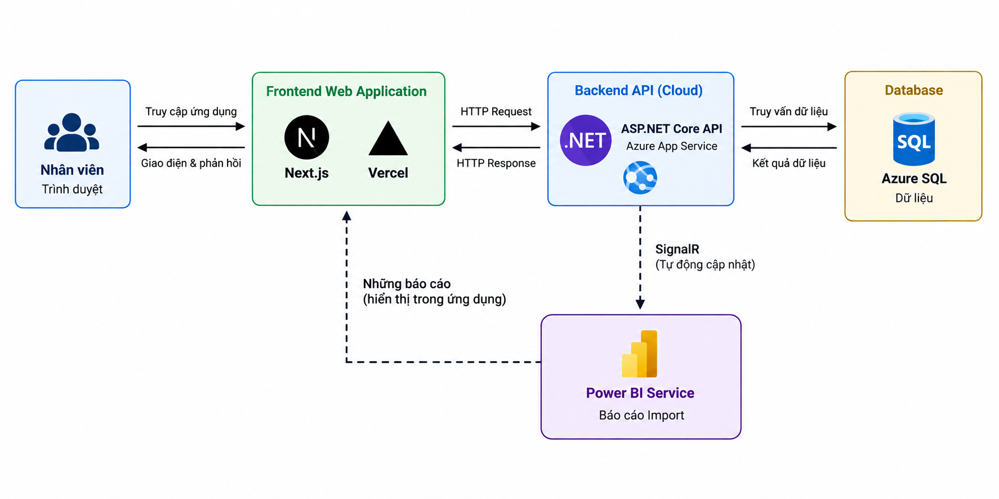
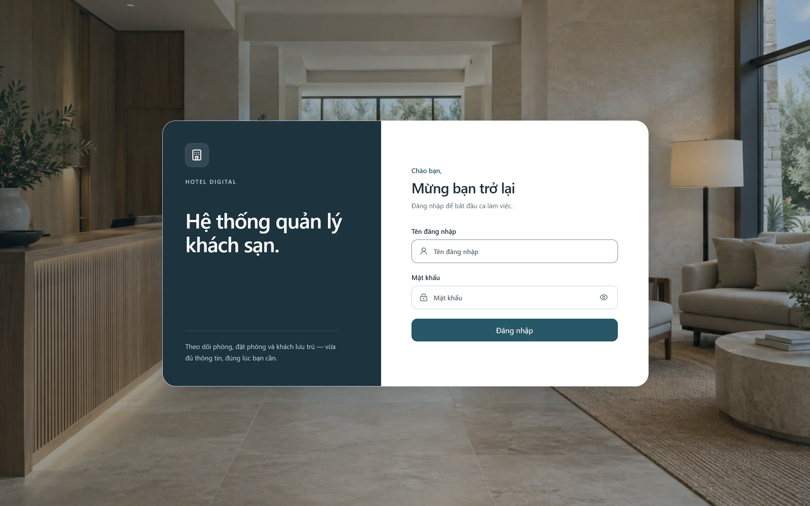
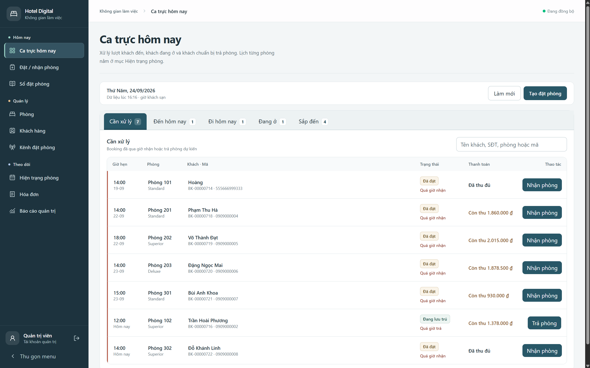
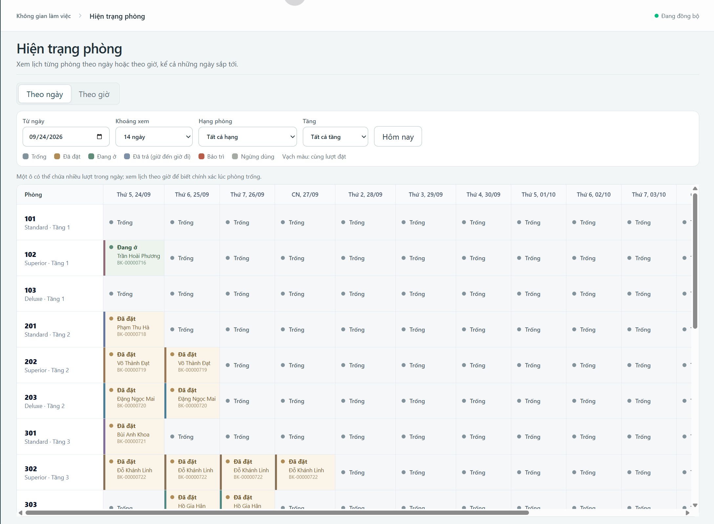
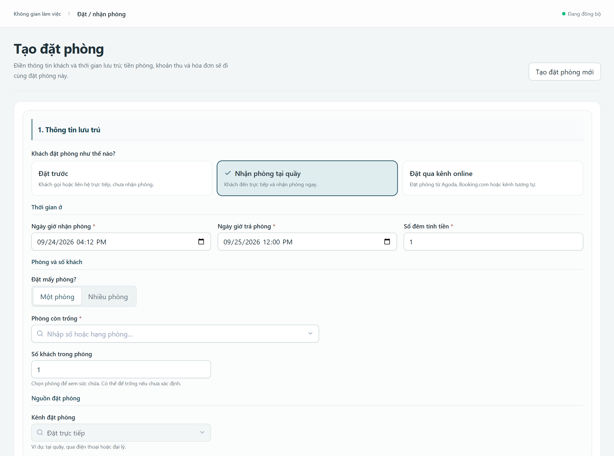
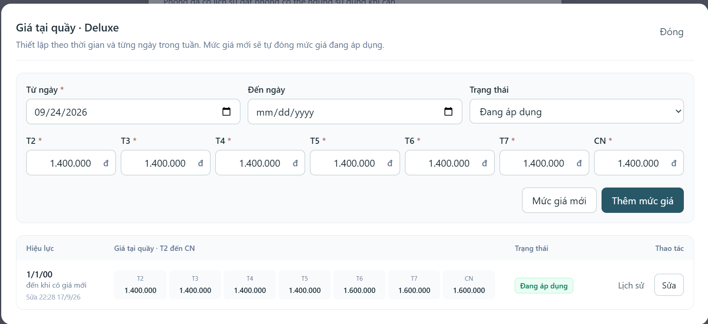
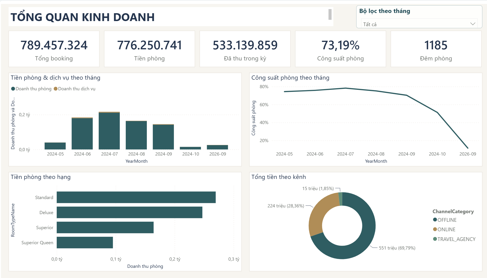
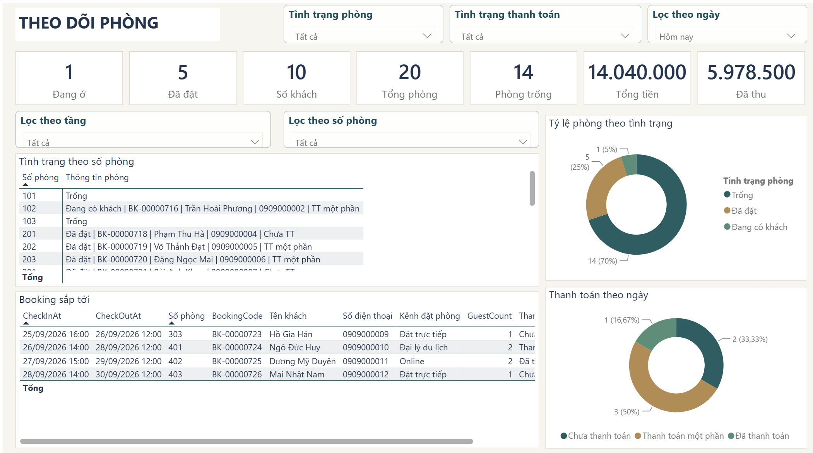

# Hotel Digital — Số hóa vận hành khách sạn

Hotel Digital là hệ thống web hỗ trợ một khách sạn tại TP.HCM quản lý đặt phòng, phòng, khách hàng, thanh toán và theo dõi hoạt động kinh doanh trên cùng một nguồn dữ liệu.

**Xem sản phẩm:** [Web vận hành](https://hotel-digital.vercel.app/) · [Báo cáo Power BI](https://app.powerbi.com/view?r=eyJrIjoiNjNiYWY2NWItMzIwNC00NjMwLTk2NGItZTRkMzkxZmQzN2RjIiwidCI6IjZhYzJhZDA2LTY5MmMtNDY2My1iN2FmLWE5ZmYyYTg2NmQwYyIsImMiOjEwfQ%3D%3D&pageName=34db4ea7000e0452673c)

## Vấn đề

Thông tin đặt phòng, lưu trú và doanh thu trước đây được ghi chép thủ công rồi chuyển giữa các bộ phận. Khi doanh thu thực tế không đạt KPI dù nhân viên cho rằng đã hoàn thành chỉ tiêu, khách sạn khó tổng hợp dữ liệu và truy ra nguyên nhân chênh lệch. Phân tích dữ liệu tháng 6–10/2024 trong báo cáo dự án cho thấy công suất phòng bình quân là **46,22%**, giảm còn **17,83%** vào tháng 10.

## Mục tiêu

- Tập trung dữ liệu đặt phòng, khách, phòng, kênh bán và các khoản thu để giảm thao tác ghi chép, đối chiếu thủ công.
- Giúp nhân viên xử lý ca trực, đặt/nhận/trả phòng và theo dõi tình trạng phòng; giúp quản lý xem doanh thu, công suất và cơ cấu nguồn khách.
- Tạo cơ sở đối chiếu KPI và đánh giá mục tiêu tăng doanh thu **từ 20%** sau triển khai trên cùng kỳ gốc và cách tính.

## Kiến trúc giải pháp

Giao diện **Next.js** triển khai trên **Vercel** gọi **ASP.NET Core API** trên **Azure App Service**. API xử lý nghiệp vụ và lưu dữ liệu tập trung trong **Azure SQL**. **SignalR** báo thay đổi để các màn hình vận hành tải lại dữ liệu. **Power BI** được nhúng vào web để xem báo cáo quản trị; báo cáo dùng mô hình Import nên phụ thuộc lịch làm mới, không cập nhật tức thời theo SignalR.

## Giao diện web

Web phục vụ các nghiệp vụ từ tạo đặt phòng, tra cứu sổ đặt phòng đến quản lý phòng, bảng giá, khách hàng, kênh bán và hóa đơn.

### Đăng nhập

Nhân viên đăng nhập để truy cập không gian làm việc nội bộ.

### Ca trực hôm nay

Màn hình chính tập hợp các lượt cần xử lý, khách đến, khách đi, khách đang ở và các lượt sắp đến.

### Hiện trạng phòng theo ngày

Lịch hiển thị từng phòng theo ngày với trạng thái trống, đã đặt, đang ở hoặc bảo trì. Nhân viên có thể lọc theo hạng, tầng và chuyển sang lịch theo giờ để kiểm tra thời điểm phòng sẵn sàng.

### Tạo đặt phòng

Nhân viên chọn hình thức đặt, thời gian lưu trú, phòng và kênh đặt trước khi ghi nhận khách và thanh toán.

### Quản lý bảng giá

Bảng giá tại quầy có thời gian hiệu lực và mức giá riêng theo từng ngày trong tuần.

## Dashboard Power BI

[Báo cáo Power BI](https://app.powerbi.com/view?r=eyJrIjoiNjNiYWY2NWItMzIwNC00NjMwLTk2NGItZTRkMzkxZmQzN2RjIiwidCI6IjZhYzJhZDA2LTY5MmMtNDY2My1iN2FmLWE5ZmYyYTg2NmQwYyIsImMiOjEwfQ%3D%3D&pageName=34db4ea7000e0452673c) có hai trang: **Tổng quan kinh doanh** và **Theo dõi phòng**.

### Tổng quan kinh doanh

Trang tổng quan theo dõi giá trị booking, tiền phòng, tiền đã thu, công suất và đêm phòng; các biểu đồ cho thấy xu hướng theo tháng và đóng góp của hạng phòng, nhóm kênh.

### Theo dõi phòng

Trang theo dõi phòng cho biết phòng trống, đã đặt, đang có khách và tình trạng thanh toán trong kỳ lọc.
