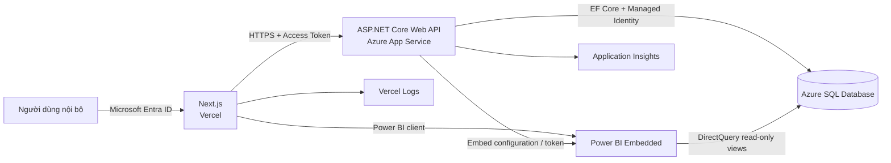

# Kế hoạch triển khai Web vận hành khách sạn A26 Phạm Ngũ Lão

> **Cập nhật 17/09/2026:** Nền tảng vận hành cốt lõi đã hoàn thành và PR #1 đã merge vào `main`; CI `api` và `web` đều thành công. Dữ liệu Azure SQL đã qua 12/12 kiểm tra cấu trúc và toàn vẹn. Backend đạt 22/22 test; frontend qua lint, type-check và production build; hai image Docker đã build, recreate và smoke-test HTTP `200`. Phần còn lại trước production là Dashboard, import/export Excel, Power BI Embedded, Entra production/App Roles, hạ tầng Azure/Vercel, quan sát hệ thống và UAT.

## 0. Trạng thái hiện tại

| Nhóm | Trạng thái | Ghi chú |
|---|---|---|
| Booking, khách hàng, sổ đặt phòng | Hoàn thành | Có validation, phân trang, concurrency và audit |
| Phòng, bảo trì, lịch ngày/giờ | Hoàn thành | Chưa có kéo-thả booking hoặc housekeeping |
| Bảng giá theo ngày | Hoàn thành | Có khoảng hiệu lực, temporal history và chặn chồng khoảng giá |
| Kênh, thanh toán, hóa đơn | Hoàn thành | Hóa đơn có màn hình xem và in |
| Dữ liệu lịch sử | Hoàn thành | Quốc tịch và kênh tại quầy đã chuẩn hóa; `MB-PNL` là master bill nội bộ |
| Dashboard vận hành | Chưa triển khai | Route hiện chỉ là placeholder và chưa đưa vào điều hướng |
| Nhập/xuất Excel trên web | Chưa triển khai | Importer dòng lệnh đã có; không đưa nút placeholder vào UI |
| Power BI Embedded | Chưa triển khai | Chờ chốt semantic model, license/capacity và quyền đọc |
| Production Azure/Vercel | Chưa triển khai | Local Docker dùng Device Code Flow; production phải dùng Managed Identity |

## 1. Kết luận và phạm vi của phiên bản này

Hệ thống giai đoạn đầu là một web app nội bộ, phục vụ các thao tác hằng ngày:

- Nhập và cập nhật đặt phòng.
- Check-in, check-out, hủy phòng và no-show.
- Xem sổ đặt phòng, doanh thu và thanh toán.
- Xem tình trạng phòng.
- Tra cứu khách hàng.
- Quản lý danh mục kênh đặt phòng ở mức tối thiểu.
- Xem lịch phòng theo ngày/giờ và quản lý lịch bảo trì.
- Quản lý bảng giá tại quầy theo từng ngày trong tuần và khoảng hiệu lực.
- Theo dõi thanh toán, lập, xem và in hóa đơn.
- Hoàn thiện Dashboard, nhập/xuất Excel và Power BI Embedded ở chặng triển khai tiếp theo.

Các ảnh giao diện được cung cấp chỉ dùng để tham khảo cách chia tab, bố cục form và bảng. Trường dữ liệu, công thức và phạm vi chức năng phải bám theo database hiện có và file `A26 Pham Ngu Lao Report 6 months.xlsx`.

Các quyết định chính:

1. Giao diện dùng Next.js và triển khai trên Vercel; nghiệp vụ/database đi qua ASP.NET Core Web API trên Azure App Service.
2. Dashboard vận hành gần thời gian thực sẽ được xây trực tiếp trong web; Power BI Embedded phục vụ phân tích quản trị sau khi read model và license được chốt.
3. Đã có lịch phòng dạng ma trận theo ngày và lịch theo giờ; kéo-thả booking vẫn ngoài phạm vi.
4. Đã có hóa đơn nghiệp vụ cơ bản; chưa có upload chứng từ, Blob Storage, kế toán kép, housekeeping hoặc đồng bộ OTA.
5. Không thêm cột lưu `Ngày check-in gần nhất` vào bảng `Customer`; giá trị này được tính từ dữ liệu `Booking` để tránh dữ liệu trùng và sai lệch.
6. Importer dòng lệnh đã phục vụ dữ liệu lịch sử. Luồng nhập Excel trên web khi triển khai phải có xem trước, báo lỗi và chống nhập trùng; không ghi thẳng file vào bảng `Booking`.
7. MVP có Entra ID để xác định người dùng và ghi `AuditLog`; phân quyền chi tiết bằng Entra App Roles và màn hình tra cứu nhật ký chuyển sang giai đoạn 2.
8. `MB-PNL` đã được xác nhận là pseudo-room/master bill, không phải phòng thật và luôn bị loại khỏi công suất, danh sách phòng vật lý và số phòng trống.
9. `CommissionRate` là tỷ lệ hoa hồng tham chiếu của kênh bán. MVP không nhập, hiển thị hay dùng trường này trong công thức vì chưa có quy trình đối soát hoa hồng.
10. Thiết kế chức năng booking, khách, phòng, kênh và dashboard phải ổn định trước khi chốt hợp đồng import Excel. Workbook hiện tại và cột mã chuẩn do người dùng bổ sung là đầu vào phân tích cho giai đoạn import, không phải lý do để làm lệch mô hình nghiệp vụ của web.

## 2. Nguồn dữ liệu dùng để lập kế hoạch

### 2.1 Nguồn được sử dụng

Chỉ dùng sheet `A26 Pham Ngu Lao` trong file `week3/A26 Pham Ngu Lao Report 6 months.xlsx` làm dữ liệu nghiệp vụ tham chiếu.

Không dùng số liệu trong các file bảng giá, Pivot hoặc nội dung minh họa trên ảnh để tự tạo thêm trường hay quy tắc nghiệp vụ.

### 2.2 Đặc điểm dữ liệu thực tế

| Nội dung | Kết quả |
|---|---:|
| Dòng lưu trú | 734 |
| Khoảng ngày đến | 18/05/2024 - 08/10/2024 |
| Mã đặt phòng khác nhau | 633 |
| Phòng vật lý | 20 |
| Giá trị phòng gồm pseudo-room `MB-PNL` | 21 |
| Loại phòng | 5 |
| Tổng số đêm | 1.535 |
| Tổng tiền phòng | 921.979.535 đ |
| Tổng dịch vụ | 21.588.883 đ |
| Tổng doanh thu theo file | 941.364.118 đ |
| Dòng thiếu số điện thoại | 352 |
| Dòng thiếu email | 643 |
| Dòng thiếu giấy tờ | 546 |
| Dòng thiếu nguồn đặt phòng | 37 |

Các giá trị nguồn đặt phòng xuất hiện trong file là `Booked_CTV`, `ONLINE`, `OTA`, `Booked_TA`, `Công ty` và giá trị trống. MVP không mặc định rằng một dòng `ONLINE` hay `OTA` thuộc Agoda, Booking.com hoặc nền tảng cụ thể nào.

### 2.3 Database hiện có

Database hiện có các bảng nghiệp vụ chính:

| Bảng | Vai trò |
|---|---|
| `hotel.Customer` | Hồ sơ khách hàng |
| `hotel.RoomType` | Hạng phòng |
| `hotel.Room` | Phòng vật lý hoặc pseudo-room |
| `hotel.Channel` | Nguồn/kênh đặt phòng |
| `hotel.Booking` | Một phòng cho một lượt lưu trú và một dòng sổ cái |
| `hotel.RoomBlock` | Khoảng thời gian khóa phòng để bảo trì |
| `hotel.RoomRate` | Bảng giá tại quầy theo ngày và khoảng hiệu lực |
| `hotel.RoomRateHistory` | Lịch sử tự động của `RoomRate` bằng temporal table |
| `hotel.Payment` | Giao dịch thanh toán theo booking |
| `hotel.Invoice` | Snapshot hóa đơn của booking |
| `hotel.AuditLog` | Nhật ký thao tác nghiệp vụ |

Các view hiện có tiếp tục được dùng khi phù hợp:

- `hotel.vBookingLedger`.
- `hotel.vRoomStatus`.
- `hotel.vRoomNight`.
- `hotel.vDashboardMonthly`.
- `hotel.vDashboardChannel`.
- `hotel.vDashboardRoomType`.
- `hotel.vDashboardNationality`.
- `hotel.vRoomRateVersionTimeline`.

## 3. Công nghệ đề xuất

### 3.1 Stack cho MVP

| Thành phần | Lựa chọn | Lý do |
|---|---|---|
| Frontend | Next.js + TypeScript, App Router | Phù hợp dashboard, form, bảng dữ liệu và triển khai trực tiếp trên Vercel |
| Giao diện | Tailwind CSS + component nội bộ | Đang dùng; giữ giao diện đồng nhất và tránh thêm dependency không cần thiết |
| Biểu đồ | Chưa chốt; dự kiến Recharts nếu cần | Chỉ bổ sung cùng Dashboard, sau khi xác nhận loại biểu đồ và bundle impact |
| Backend | ASP.NET Core 10 Web API | Chứa xác thực, validation, nghiệp vụ booking và truy cập database; bổ sung policy phân quyền ở giai đoạn 2 |
| Truy cập dữ liệu | Entity Framework Core, database-first | Tận dụng schema, computed column, view và trigger hiện có; database scripts vẫn là nguồn quản lý schema |
| Database | Azure SQL Database | Dùng trực tiếp thiết kế hiện có |
| Hosting frontend | Vercel | Mục tiêu production; hiện chạy local/Docker |
| Hosting backend | Azure App Service | Mục tiêu production; kết nối Azure SQL bằng Managed Identity |
| Đăng nhập | Microsoft Entra ID + MSAL | Frontend lấy access token; API xác thực danh tính, còn role-based authorization triển khai ở giai đoạn 2 |
| Giám sát | Vercel Logs + Application Insights | Chưa cấu hình production |
| Báo cáo quản trị | Power BI Embedded + DirectQuery | Chưa triển khai; là kiến trúc mục tiêu |
| Excel | Importer .NET hiện có; API web ở chặng sau | Import lịch sử đã có, preview/confirm/export trên web chưa triển khai |

.NET 10 là bản LTS. Next.js được Vercel hỗ trợ trực tiếp. ASP.NET Core, Entity Framework Core và Azure SQL có đường tích hợp chính thức; App Service kết nối Azure SQL bằng Managed Identity mà không lưu mật khẩu database trong source code.

### 3.2 Lý do chọn Next.js + ASP.NET Core API

Next.js giúp làm dashboard, bảng, form, trạng thái và responsive nhanh hơn, đồng thời có preview deployment trên Vercel. ASP.NET Core API giữ toàn bộ nghiệp vụ và truy cập dữ liệu ở Azure, phù hợp schema SQL Server hiện có.

Đổi lại, hệ thống có hai deployment. Phạm vi API phải giữ gọn và frontend không lặp lại công thức nghiệp vụ đã có ở API/database.

## 4. Kiến trúc MVP



Nguyên tắc:

- Next.js chịu trách nhiệm hiển thị và thu thập dữ liệu nhập.
- ASP.NET Core API chịu trách nhiệm xác thực, validation và cập nhật nghiệp vụ; policy theo role được bổ sung ở giai đoạn 2.
- Azure SQL là nguồn dữ liệu duy nhất.
- Các công thức tiền và ràng buộc chống trùng phòng tiếp tục được bảo vệ ở database.
- Frontend trên Vercel không được kết nối trực tiếp Azure SQL và không giữ thông tin đăng nhập database.
- API chỉ cho phép CORS từ domain production của Vercel và các domain preview đã được kiểm soát.
- Frontend và API có biến môi trường riêng cho Development, Preview/Test và Production.
- Dashboard Next.js không cache dữ liệu vận hành; sau mỗi thao tác ghi phải tải lại KPI liên quan.
- Power BI chỉ được cấp quyền đọc các view báo cáo, không ghi vào bảng nghiệp vụ.
- API lấy danh tính người thực hiện từ access token Entra; không nhận `UserID` hoặc email do frontend tự gửi lên.
- Ghi thay đổi nghiệp vụ và `AuditLog` trong cùng transaction để không có trường hợp dữ liệu đã đổi nhưng mất dấu người thực hiện.

### 4.1 Nhóm API tối thiểu

| Nhóm | Trạng thái | Endpoint chính |
|---|---|---|
| Booking và trạng thái | Hoàn thành | `GET/POST/PUT /api/bookings`, các endpoint check-in/check-out/cancel/no-show |
| Phòng và bảo trì | Hoàn thành | `/api/rooms`, `/api/room-blocks`, lịch ngày và lịch giờ |
| Bảng giá phòng | Hoàn thành | `/api/room-rates`, gồm lịch sử phiên bản |
| Khách hàng | Hoàn thành | `/api/customers`, gồm lịch sử lưu trú |
| Kênh | Hoàn thành | `/api/channels` |
| Thanh toán và hóa đơn | Hoàn thành | `/api/bookings/{id}/payments`, `/api/invoices` |
| Dashboard | Chưa triển khai | Dự kiến `/api/dashboard/overview`, `/api/dashboard/daily` |
| Excel | Chưa triển khai trên web | Dự kiến preview/confirm import và export ledger |
| Power BI | Chưa triển khai | Dự kiến `/api/power-bi/embed-config` |

API trả lỗi validation theo một định dạng thống nhất để Next.js hiển thị ngay tại trường nhập liệu.

## 5. Điều hướng và màn hình

Thanh điều hướng hiện có sáu mục:

1. Đặt phòng & Check-in.
2. Sổ đặt phòng.
3. Phòng.
4. Khách hàng.
5. Hóa đơn.
6. Kênh đặt phòng.

Dashboard chưa đưa vào điều hướng vì mới là placeholder. Khi hoàn thành, Power BI nằm trong Dashboard; chức năng nhập/xuất Excel đặt trong màn hình Sổ đặt phòng. Lịch phòng và bảo trì nằm trong màn hình Phòng, không tạo mục điều hướng riêng.

### 5.1 Dashboard

> **Trạng thái:** Chưa triển khai. Route hiện là placeholder và không nằm trong điều hướng; nội dung dưới đây là tiêu chí xây dựng cho chặng B.

Dashboard mục tiêu nằm trong web app, gồm hai tab vận hành **Tổng quan**, **Theo ngày** và một tab phân tích **Power BI**. Hai tab vận hành sẽ dùng component Next.js và API của hệ thống; tab Power BI nhúng báo cáo quản trị sau khi báo cáo được publish.

#### Tab Tổng quan

Bộ lọc mặc định là từ ngày đầu đến ngày cuối của **tháng hiện tại** theo múi giờ Việt Nam; cho phép chọn khoảng ngày khác. Khi tải lại trang, nếu URL không có bộ lọc thì luôn quay về tháng hiện tại.

Hiển thị:

- Tổng số booking trong khoảng ngày.
- Số đêm phòng đã bán.
- Số đêm phòng có thể bán.
- Tỷ lệ lấp đầy.
- Tổng doanh thu.
- Đã thanh toán.
- Công nợ.
- Còn thiếu.
- Cơ cấu booking theo nguồn/kênh.
- Số đêm và doanh thu theo hạng phòng.
- Cơ cấu khách theo quốc tịch.

Quy ước thời gian phải hiển thị ngay dưới bộ lọc: doanh thu và số booking được gán theo `CheckInAt`; công suất dùng `StayDate` từ `vRoomNight`. Không cộng trực tiếp các tỷ lệ tháng để tạo tỷ lệ cho một khoảng ngày.

Biểu đồ quốc tịch dùng `Customer.Nationality`; giá trị trống được gom vào `Chưa xác định`. File Excel lịch sử không có cột quốc tịch đáng tin cậy nên tỷ trọng `Chưa xác định` ban đầu sẽ cao và phải được ghi chú trên biểu đồ.

Dashboard vận hành dùng dữ liệu trực tiếp từ API với `cache: no-store`, tự làm mới sau khi tạo/sửa/check-in/check-out và có chu kỳ tải lại cấu hình được, mặc định 30 giây. Đây là dashboard gần thời gian thực của nhân viên.

#### Tab Theo ngày

Người dùng chọn một ngày cụ thể. Màn hình hiển thị:

- Tổng phòng vật lý đang hoạt động.
- Số phòng có khách trong ngày.
- Số phòng trống trong ngày.
- Tỷ lệ lấp đầy trong ngày.
- Số lượt đến trong ngày.
- Số lượt đi trong ngày.
- Cơ cấu booking theo nguồn trong ngày.
- Danh sách phòng có khách: phòng, khách, nguồn, giờ đến, giờ đi, trạng thái.
- Danh sách phòng trống.

Quy ước tính:

```text
Tỷ lệ lấp đầy = Số phòng có đêm lưu trú trong ngày / Số phòng vật lý đang hoạt động
```

`MB-PNL` đã được xác nhận là pseudo-room/master bill, không phải phòng thật. Giá trị này và mọi record có `CountsTowardOccupancy = 0` không tham gia mẫu số công suất, số phòng trống hoặc danh sách phòng vật lý; dữ liệu lịch sử liên quan vẫn được giữ trong sổ cái.

Không đưa “doanh thu trong ngày” vào tab này ở MVP. Booking hiện lưu doanh thu tổng cho cả lượt lưu trú, không lưu doanh thu theo từng ngày; tự chia đều sẽ tạo số liệu có vẻ chính xác nhưng không đúng nguồn.

### 5.2 Đặt phòng & Check-in

Một form dùng cho tạo booking mới và cập nhật booking hiện có.

#### Thông tin phòng và thời gian

- Phòng.
- Ngày giờ đến.
- Ngày giờ đi.
- Số đêm, hệ thống tự tính và cho phép xác nhận.
- Kênh đặt phòng.
- Mã booking bên ngoài nếu có.

Hạng phòng và giá niêm yết được lấy từ phòng đã chọn, không nhập lại thành hai trường độc lập.

#### Thông tin khách hàng

- Tìm khách hiện có theo tên, số điện thoại hoặc CCCD/Passport.
- Chọn hồ sơ hiện có hoặc tạo khách mới.
- Họ tên.
- Số điện thoại.
- Email.
- CCCD/Passport.
- Quốc tịch.
- Ghi chú.

Số điện thoại, email và giấy tờ không bắt buộc vì dữ liệu thực tế thiếu nhiều. Không tự gộp hai khách chỉ vì trùng một trường.

#### Doanh thu và thanh toán

- Tiền phòng.
- Dịch vụ.
- Phụ thu.
- Giảm giá.
- Lý do giảm giá khi số tiền giảm lớn hơn 0.
- Nợ trước.
- Tiền mặt.
- Thẻ.
- Chuyển khoản.
- Công nợ.

Các giá trị sau chỉ hiển thị, không cho nhập trực tiếp:

```text
Tổng doanh thu = Tiền phòng + Dịch vụ + Phụ thu - Giảm giá
Đã thanh toán = Tiền mặt + Thẻ + Chuyển khoản
Còn thiếu = Nợ trước + Tổng doanh thu - Đã thanh toán - Công nợ
Giá phòng trung bình = Tiền phòng / Số đêm
```

#### Thao tác trạng thái

- Lưu booking ở trạng thái `BOOKED`.
- Check-in chuyển sang `CHECKED_IN`.
- Check-out chuyển sang `CHECKED_OUT`.
- Hủy chuyển sang `CANCELLED`.
- No-show chuyển sang `NO_SHOW`.

Không xóa booking đã phát sinh.

### 5.3 Sổ đặt phòng

Một dòng tương ứng một record `Booking`.

Cột chính:

- Mã booking.
- Phòng.
- Khách hàng.
- Ngày giờ đến.
- Ngày giờ đi.
- Số đêm.
- Kênh.
- Tiền phòng.
- Dịch vụ.
- Tổng doanh thu.
- Đã thanh toán.
- Công nợ.
- Còn thiếu.
- Trạng thái.
- Thao tác xem/sửa.

Bộ lọc:

- Khoảng ngày đến.
- Phòng hoặc hạng phòng.
- Trạng thái.
- Kênh.
- Tình trạng thanh toán.
- Tìm theo mã booking, tên khách hoặc số điện thoại.

Phân trang hiện thực hiện ở server. Khi chặng export hoàn thành, nút **Xuất Excel** phải xuất toàn bộ kết quả theo bộ lọc hiện tại, không chỉ trang đang xem. File xuất phải giữ kiểu ngày, số và tiền tệ để người dùng tiếp tục lọc/tính trong Excel.

### 5.4 Phòng

Danh sách phòng hiển thị:

- Số phòng.
- Hạng phòng.
- Tầng.
- Giá niêm yết/đêm nếu đã có dữ liệu được xác nhận.
- Trạng thái hiện tại: trống, đã đặt, đang có khách hoặc ngừng hoạt động.
- Khách hiện tại nếu có.
- Lần nhận phòng kế tiếp.
- Thao tác tạo booking/check-in.
- Ma trận hiện trạng 7/14/21/31 ngày.
- Lịch chi tiết theo giờ và bộ lọc phòng/hạng/tầng.
- Danh sách và form quản lý lịch bảo trì.
- Bảng giá tại quầy theo từng ngày trong tuần, khoảng hiệu lực và lịch sử thay đổi.

Phiên bản hiện tại chưa có housekeeping, trạng thái phòng bẩn/sạch hoặc kéo-thả lịch phòng.

### 5.5 Khách hàng

Danh sách khách hàng hiển thị:

- ID.
- Họ tên.
- Số điện thoại.
- CCCD/Passport.
- Quốc tịch.
- **Ngày check-in gần nhất**.
- Thao tác xem lịch sử lưu trú hoặc cập nhật thông tin.

`Ngày check-in gần nhất` được tính như sau:

```text
MAX(Booking.CheckInAt)
với cùng CustomerID
và Booking.Status thuộc CHECKED_IN hoặc CHECKED_OUT
```

Booking tương lai, booking bị hủy và no-show không được coi là lần check-in gần nhất. Khách chưa từng check-in hiển thị `Chưa có` và nằm cuối khi sắp xếp theo cột này.

Mặc định sắp xếp theo ngày check-in gần nhất giảm dần. Cho phép tìm theo tên, số điện thoại và CCCD/Passport.

### 5.6 Kênh đặt phòng

MVP có danh sách kênh và form **Thêm/Sửa kênh đặt phòng**.

Trường trên form:

- Mã kênh.
- Tên kênh.
- Nhóm `DIRECT`, `OTA`, `PARTNER`, `INTERNAL` hoặc `UNKNOWN`.
- Đang hoạt động/ngừng hoạt động.
- Ghi chú.

Mã kênh và tên kênh là bắt buộc; mã kênh không được trùng. Kênh đã được booking sử dụng không bị xóa mà chuyển sang ngừng hoạt động để giữ lịch sử. Kênh ngừng hoạt động không xuất hiện trong dropdown tạo booking mới nhưng vẫn hiển thị trên booking cũ và báo cáo.

`CommissionRate` là tỷ lệ phần trăm hoa hồng tham chiếu mà khách sạn có thể phải trả cho kênh bán. Trường đã tồn tại trong schema nhưng MVP không hiển thị, không cho nhập và không dùng để tính doanh thu vì chưa có quy trình đối soát hoa hồng. Giữ cột nullable để không phải đổi schema nếu nghiệp vụ này được xác nhận về sau.

Các kênh chi tiết như Agoda, Booking.com hoặc Traveloka không được suy ra từ giá trị tổng quát `ONLINE`/`OTA` trong dữ liệu cũ.

### 5.7 Power BI Embedded trong Dashboard

> **Trạng thái:** Chưa triển khai. Nội dung dưới đây là thiết kế mục tiêu sau khi Dashboard vận hành và license/capacity được chốt.

Thiết kế mục tiêu đặt tab **Power BI** bên trong mục Dashboard của Next.js, không có mục điều hướng riêng. Báo cáo được xây dựng sau khi các chức năng và read model vận hành đã ổn định: tạo report bằng Power BI Desktop, publish lên Power BI Service, kết nối/DirectQuery đến các view Azure SQL rồi nhúng report vào web.

Phạm vi báo cáo:

- KPI doanh thu, thực thu, công nợ, ADR, RevPAR và tỷ lệ lấp đầy.
- Xu hướng theo ngày/tháng.
- Doanh thu và số booking theo nguồn/kênh.
- Doanh thu theo hạng phòng.
- Cơ cấu quốc tịch, gồm nhóm `Chưa xác định`.
- Bộ lọc thời gian, hạng phòng, phòng và kênh.

Vì người dùng là nhân viên nội bộ đăng nhập Entra ID, mặc định dùng **Embed for your organization**. Cần xác nhận Power BI Pro/PPU hoặc Fabric/Power BI capacity trước khi go-live.

Power BI dùng DirectQuery đến các view Azure SQL để có dữ liệu gần thời gian thực. Automatic page refresh chỉ bật khi gói/capacity được chọn hỗ trợ. Dashboard vận hành Next.js vẫn là nơi theo dõi tức thời và thực hiện thao tác; Power BI không thay thế màn hình vận hành.

### 5.8 Nhập và xuất Excel

> **Trạng thái:** Chưa triển khai trên web. Importer dòng lệnh hiện có chỉ phục vụ nhập dữ liệu lịch sử/schema; các nút placeholder Nhập/Xuất Excel đã được loại khỏi UI.

#### Nhập Excel

Khi triển khai, nút **Nhập Excel** đặt tại Sổ đặt phòng và dùng chung cho nhóm tài khoản thử nghiệm đã được cấp quyền truy cập ứng dụng. Giai đoạn phân quyền sẽ giới hạn nút và endpoint này cho Quản lý/Quản trị viên.

Luồng xử lý:

1. Tải file `.xlsx`; không nhận `.xls` hoặc `.xlsm` trong MVP.
2. API kiểm tra kích thước, tên sheet và bộ header bắt buộc.
3. API đọc dữ liệu nhưng chưa ghi vào `Booking`.
4. Màn hình xem trước hiển thị tổng số dòng, dòng hợp lệ, dòng lỗi, dòng cảnh báo và dòng có nguy cơ trùng.
5. Người dùng tải file lỗi hoặc sửa file nguồn rồi kiểm tra lại.
6. Chỉ khi không còn lỗi chặn, người dùng mới chọn **Xác nhận nhập**; frontend gửi lại chính file đó và API kiểm tra khớp `FileHash` trước khi ghi.
7. API nhập toàn bộ batch trong một transaction; nếu một lỗi phát sinh thì rollback cả batch.

API không lưu file Excel tạm sau import. Cách gửi lại file khi xác nhận giúp giữ Blob Storage ngoài phạm vi mà vẫn bảo đảm nội dung được nhập đúng với bản đã xem trước.

Thiết kế parser được thực hiện sau khi các chức năng nhập liệu trên web, database và quy tắc validation đã ổn định. Khi đó đội triển khai rà lại workbook `A26 Pham Ngu Lao`, dữ liệu phân tích đã có và cột mã chuẩn do người dùng bổ sung ở cuối sheet để chốt mapping cuối cùng.

Parser xác định cột theo tên header hoặc danh sách alias được duyệt, không phụ thuộc vị trí cột. Cột mã chuẩn được dùng như dữ liệu hỗ trợ ánh xạ khi header và ý nghĩa cụ thể đã được xác nhận; không tự động thay thế mã phòng, hạng phòng, kênh hoặc booking trong database chỉ vì nó nằm ở cột cuối. Có thể phát hành một template nhập mới sau khi mapping thực tế được kiểm thử.

Quy tắc kiểm tra tối thiểu:

- Phòng, loại phòng, ngày đến, ngày đi, số đêm, các cột tiền và trạng thái phải hợp lệ.
- Ngày đi phải sau ngày đến.
- Không có số tiền âm; công thức tổng tiền phải đối chiếu được.
- Nguồn trống ánh xạ `UNKNOWN`; nguồn mới phải được người dùng xác nhận trước khi tạo.
- Không tự gộp khách chỉ theo tên. Chỉ gợi ý khớp khi có tổ hợp thông tin đủ mạnh và người dùng có thể xem cảnh báo.
- Kiểm tra trùng phòng/thời gian trước khi xác nhận.
- Hash file và số dòng nguồn được dùng để ngăn nhập lại cùng một batch.

#### Xuất Excel

- Xuất sổ đặt phòng theo toàn bộ bộ lọc đang chọn.
- Giữ các cột nghiệp vụ và các giá trị tính sẵn từ database.
- Ngày, số đêm, tỷ lệ và tiền được ghi dưới dạng dữ liệu Excel thực, không phải chuỗi đã định dạng.
- Tên file gồm khách sạn và khoảng ngày lọc.
- File xuất không chứa cột nội bộ như `rowversion` hoặc thông tin xác thực.

## 6. Thay đổi dữ liệu cần cho web

### 6.1 Các trường không cần lưu thêm

Các dữ liệu sau vẫn được tính từ quan hệ hiện có:

- Không thêm `LastCheckInAt` vào `hotel.Customer`.
- Không thêm trường tổng doanh thu, đã thanh toán, còn thiếu hoặc giá trung bình vì database đã có computed column.
- Không thêm hạng phòng vào `hotel.Booking` vì suy ra từ `Room`.

### 6.2 Bổ sung theo dõi import Excel

Tính năng nhập Excel lặp lại trên web chưa triển khai và cần bổ sung:

#### Bảng `hotel.ImportBatch`

- `ImportBatchID`.
- `FileName`.
- `FileHash` SHA-256, đặt unique để nhận biết file đã nhập.
- `Status`: `PREVIEWED`, `IMPORTED`, `FAILED`.
- `TotalRows`, `ValidRows`, `ErrorRows`, `ImportedRows`.
- `UploadedBy`, `UploadedAt`, `ImportedAt`.
- `ErrorSummary` nếu batch thất bại.

#### Cột trên `hotel.Booking`

- `ImportBatchID` nullable, khóa ngoại đến `hotel.ImportBatch`.
- Tạo unique index trên `(ImportBatchID, LegacySourceRow)` khi `ImportBatchID` khác null.

Hai thay đổi này là phần database còn thiếu để import qua giao diện an toàn. Nếu chỉ chạy script nhập lịch sử đúng một lần thì không bắt buộc, nhưng khi chức năng nhập Excel nằm trong MVP thì phải có.

### 6.3 Cần bổ sung read model

Đề xuất bổ sung hai view hoặc hai truy vấn tương đương trong lớp service:

#### `hotel.vCustomerList`

- Các trường cơ bản của khách.
- `LastCheckInAt` tính bằng `MAX(CheckInAt)` trên booking đã check-in/check-out.
- `StayCount` để hỗ trợ xem khách quay lại nếu cần.

Danh sách khách hiện đã tính các giá trị này bằng projection/query trong API; chỉ tạo view riêng nếu đo đạc cho thấy cần tối ưu báo cáo.

#### `hotel.vDashboardDaily`

- `StayDate`.
- `ActiveRoomCount`.
- `OccupiedRoomCount`.
- `AvailableRoomCount`.
- `OccupancyRate`.
- `ArrivalCount`.
- `DepartureCount`.

Danh sách nguồn và phòng chi tiết có thể truy vấn theo `StayDate`; không cần lưu snapshot hằng ngày.

Read model Dashboard vẫn chưa triển khai.

### 6.4 Bổ sung nhật ký thao tác

Phân quyền không thay thế nhật ký. Bảng `hotel.AuditLog` và service ghi audit đã được triển khai với các trường chính:

- `AuditLogID`.
- `OccurredAtUtc`.
- `ActorObjectID`: Object ID từ Entra access token.
- `ActorDisplayName`, `ActorEmail`: snapshot để lịch sử vẫn đọc được khi thông tin Entra thay đổi.
- `ActorRole` nullable; bắt đầu ghi khi triển khai phân quyền ở giai đoạn 2.
- `Action`: `CREATE`, `UPDATE`, `STATUS_CHANGE`, `IMPORT`, `EXPORT`.
- `EntityType`, `EntityID`.
- `ChangesJson`: chỉ các trường thay đổi và giá trị trước/sau được phép lưu.
- `ImportBatchID` nullable.
- `CorrelationID` để nối nhiều thay đổi trong cùng một request.

Ứng dụng hiện ghi nhật ký cho các luồng nghiệp vụ đã triển khai; việc đọc vẫn thực hiện bằng truy vấn quản trị. Giai đoạn 2 mới mở endpoint/màn hình đọc cho đúng role. Không cấp `UPDATE` hoặc `DELETE` trên `AuditLog`.

Không cần lưu mật khẩu hoặc bản sao tài khoản Entra trong database. `AuditLog` chỉ lưu snapshot danh tính phục vụ tra cứu lịch sử.

## 7. Quy tắc nghiệp vụ bắt buộc

- Ngày giờ đi phải sau ngày giờ đến.
- Booking mới phải có ít nhất một đêm tính tiền.
- Không có số tiền âm.
- Giảm giá không được làm tổng doanh thu âm.
- Khi có giảm giá phải nhập lý do.
- Một phòng không được có hai booking đang hoạt động trùng thời gian.
- Không nhận booking mới cho phòng ngừng hoạt động.
- Check-out chỉ thực hiện với booking đang `CHECKED_IN`.
- Cancel/no-show không tham gia công suất phòng.
- Khi cập nhật phải kiểm tra `rowversion` để báo xung đột thay vì ghi đè dữ liệu của người khác.
- Hiển thị thời gian theo múi giờ Việt Nam.

Trigger chống trùng phòng trong database vẫn là lớp bảo vệ cuối cùng; ứng dụng kiểm tra trước để trả lỗi dễ hiểu.

## 8. Làm sạch và nhập dữ liệu lịch sử

Chỉ nhập từ sheet `A26 Pham Ngu Lao`.

Quy tắc:

- Giữ mã cũ trong `LegacyBookingCode`; không dùng làm khóa duy nhất.
- Giữ số dòng nguồn trong `LegacySourceRow` để đối chiếu.
- Nguồn trống ánh xạ sang `UNKNOWN`.
- Không tách `ONLINE` hoặc `OTA` thành nền tảng cụ thể nếu file không có bằng chứng.
- Một dòng thiếu tên khách ánh xạ vào hồ sơ `Chưa xác định` để đáp ứng `Customer.FullName NOT NULL`.
- Không gộp khách tự động chỉ theo tên, điện thoại hoặc giấy tờ.
- 25 dòng có phần giảm giữa tiền phòng + dịch vụ và tổng doanh thu được đưa vào `DiscountAmount` với lý do `Dữ liệu cũ - cần xác minh`.
- Dòng có giờ đến bằng giờ đi phải được xác nhận/sửa trước khi import.
- `MB-PNL` giữ dạng pseudo-room/master bill và không tính công suất vì đã xác nhận đây không phải phòng thật.

Mốc đối chiếu sau import:

- 734 dòng booking.
- 921.979.535 đ tiền phòng.
- 21.588.883 đ dịch vụ.
- 941.364.118 đ tổng doanh thu theo file.
- 208.114.748 đ tiền mặt.
- 471.809.031 đ chuyển khoản.
- 261.440.339 đ công nợ.
- 1.535 đêm.

Importer lịch sử đã chạy; dữ liệu hiện tại đã được đối chiếu cấu trúc sau các script `04` đến `15`. Quốc tịch còn thiếu đã được backfill, kênh `OFFLINE` đã chuẩn hóa thành `Tại quầy`, và dữ liệu bảng giá không có orphan, giá âm, lệch cột tương thích hoặc khoảng hiệu lực chồng nhau.

## 9. Đăng nhập trong MVP

Môi trường production vẫn bắt buộc đăng nhập Microsoft Entra ID để xác định người sử dụng và ghi đúng người vào `AuditLog`, nhưng chưa chia quyền theo vai trò. Tất cả tài khoản nội bộ được cấp quyền vào bản MVP có cùng tập chức năng.

Next.js dùng MSAL để đăng nhập và lấy access token dành cho API. ASP.NET Core API xác thực token bằng Microsoft Identity Web và trả `401 Unauthorized` cho request chưa đăng nhập.

Môi trường development có development user và màn hình đăng nhập cục bộ để thử luồng giao diện. Cơ chế này chỉ hoạt động khi cờ development được bật, không phải lớp bảo mật production và không được bật trên Vercel/App Service production.

Không tạo bảng mật khẩu hoặc bản sao tài khoản đăng nhập trong database. MVP chỉ nên cấp quyền cho nhóm người dùng thử nghiệm nội bộ đã được duyệt; không mở rộng cho toàn bộ tổ chức trước khi hoàn thành phân quyền giai đoạn 2.

## 10. Kế hoạch thực hiện

Kế hoạch được chuyển từ lịch tuần giả định sang các chặng có điều kiện nghiệm thu rõ ràng.

### Chặng A - Nền tảng vận hành cốt lõi — Hoàn thành

- Booking, check-in/check-out, cancel/no-show, khách hàng và sổ đặt phòng.
- Phòng, hạng phòng, lịch ngày/giờ, lịch bảo trì và bảng giá có version.
- Kênh, giao dịch thanh toán, hóa đơn xem/in và audit.
- Import dữ liệu lịch sử, chuẩn hóa dữ liệu và các script schema đến `15_room_rate_versioning.sql`.
- Docker local, CI, test backend, lint/type-check/build frontend và smoke test.

### Chặng B - Dashboard và xuất dữ liệu — Ưu tiên tiếp theo

- Xây API/read model cho Tổng quan và Theo ngày.
- Đối chiếu KPI với SQL độc lập trên một bộ dữ liệu cố định.
- Thêm Dashboard vào điều hướng sau khi không còn placeholder.
- Làm export sổ đặt phòng thật; chỉ hiển thị nút khi file tải xuống hoạt động và giữ đúng kiểu ngày/số/tiền.

### Chặng C - Import Excel trên web

- Chốt mapping workbook/header alias và giới hạn file.
- Bổ sung `ImportBatch`, liên kết nguồn và unique constraint chống nhập lại.
- Xây preview, lỗi theo dòng, confirm bằng hash và rollback toàn batch.
- Ghi audit cho import và kiểm thử lại bằng workbook sáu tháng.

### Chặng D - Power BI Embedded

- Chốt license Pro/PPU hoặc capacity và mô hình quyền.
- Tạo principal chỉ đọc, semantic model và DirectQuery từ các view được duyệt.
- Đối chiếu KPI Power BI với Dashboard web.
- Nhúng báo cáo sau khi embed token/configuration được bảo vệ ở API.

### Chặng E - Production và UAT

- Cấu hình Entra production, App Roles/policy, CORS theo origin cụ thể và Managed Identity cho Azure SQL.
- Deploy frontend lên Vercel và API lên Azure App Service; không dùng Device Code Flow trong production.
- Bật Application Insights, Vercel Logs, cảnh báo, backup và kiểm thử phục hồi.
- Chạy integration/E2E cho luồng chính, kiểm thử quyền, responsive và UAT với nhân viên.
- Chỉ go-live sau khi checklist mục 11 đạt và có phương án rollback.

## 11. Tiêu chí nghiệm thu MVP

Trạng thái hiện tại:

| Nhóm | Kết quả hiện tại |
|---|---|
| Nghiệp vụ cốt lõi | Đạt ở mức code/test và dữ liệu hiện tại |
| Database bảng giá | Đạt 12/12 kiểm tra trực tiếp |
| CI | `api` và `web` thành công trên PR #1 |
| Docker local | Build/recreate thành công; frontend và OpenAPI trả `200` |
| Dashboard, Excel web, Power BI | Chưa đạt vì chưa triển khai |
| Production/UAT | Chưa thực hiện |

### Nghiệp vụ

- Tạo, sửa và tìm booking được.
- Không lưu được booking trùng phòng/thời gian.
- Check-in, check-out, cancel và no-show chuyển trạng thái đúng.
- Tổng doanh thu, đã thanh toán, công nợ, còn thiếu và giá trung bình khớp database.
- Không xóa lịch sử booking.

### Tra cứu

- Sổ đặt phòng lọc và phân trang đúng.
- Danh sách phòng phản ánh trạng thái hiện tại.
- Danh sách khách có ngày check-in gần nhất đúng theo booking thực tế.
- Khách chưa từng check-in hiển thị `Chưa có`.

### Dashboard

- Khi không có bộ lọc, Dashboard Tổng quan mặc định đúng tháng hiện tại theo giờ Việt Nam.
- Tab Tổng quan lọc theo khoảng ngày.
- Tab Theo ngày hiển thị đúng phòng có khách, phòng trống, lượt đến, lượt đi và nguồn booking.
- Dashboard vận hành cập nhật sau thao tác và tự làm mới theo chu kỳ đã cấu hình.
- Biểu đồ quốc tịch hiển thị đúng nhóm `Chưa xác định`.
- `MB-PNL` không làm sai tỷ lệ lấp đầy.
- KPI được đối chiếu với SQL bằng một bộ dữ liệu test cố định.

### Excel

- File đúng mẫu được xem trước trước khi ghi dữ liệu.
- File sai header, sai ngày, sai tiền hoặc trùng phòng hiển thị lỗi theo dòng.
- Không thể xác nhận import khi còn lỗi chặn.
- Nhập lại cùng file không tạo booking trùng.
- Batch lỗi rollback toàn bộ.
- File xuất chứa toàn bộ kết quả theo bộ lọc và giữ đúng kiểu ngày/số/tiền.

### Power BI

- Báo cáo được nhúng trong Next.js và chỉ người dùng nội bộ đã đăng nhập mới xem được.
- DirectQuery chỉ đọc các view được cấp quyền.
- Bộ lọc thời gian, phòng, hạng phòng và kênh hoạt động đúng.
- KPI Power BI khớp dashboard web theo cùng định nghĩa.

### Vận hành

- Người dùng đăng nhập bằng Entra ID.
- Request chưa đăng nhập không gọi được API.
- Frontend production chạy trên Vercel và gọi API qua HTTPS.
- Preview deployment không dùng database production.
- App Service kết nối Azure SQL bằng Managed Identity.
- Azure SQL không mở kết nối trực tiếp cho frontend/Vercel.
- Power BI Embedded có license/capacity phù hợp cho môi trường production.
- Có backup database và log lỗi ứng dụng.

### Đăng nhập và truy vết

- Mọi lần tạo/sửa booking, đổi trạng thái, import và export đều ghi đúng Entra Object ID của người thực hiện.
- Nhật ký không thể sửa hoặc xóa qua API ứng dụng.
- Dữ liệu CCCD/Passport không xuất hiện nguyên văn trong `ChangesJson`.

## 12. Giai đoạn 2 - Phân quyền và tra cứu nhật ký

Thực hiện sau khi MVP vận hành ổn định, ước tính thêm 1-2 tuần. Bổ sung ba Entra App Roles:

| Vai trò | Quyền |
|---|---|
| Nhân viên | Xem dashboard vận hành, phòng, khách và kênh; tạo/sửa booking; check-in/check-out/cancel/no-show |
| Quản lý | Toàn bộ quyền Nhân viên; xem đầy đủ số liệu tài chính; nhập/xuất Excel; sửa danh mục; xem Power BI Embedded và nhật ký thao tác |
| Quản trị viên | Toàn bộ quyền Quản lý; cấu hình ứng dụng và quản lý việc gán App Roles trong Entra |

Công việc giai đoạn 2:

- Gán App Roles trong Microsoft Entra ID và đưa role claim vào access token.
- Khai báo policy cho từng endpoint; API trả `403 Forbidden` khi không đủ quyền.
- Frontend ẩn hoặc khóa thao tác theo role, nhưng API vẫn là lớp quyết định cuối cùng.
- Bổ sung `GET /api/audit-logs` chỉ cho Quản lý và Quản trị viên.
- Thêm màn hình Nhật ký thao tác với bộ lọc thời gian, người thực hiện, hành động, loại đối tượng và mã booking/khách/batch.
- Bắt đầu ghi `ActorRole` vào `AuditLog`.
- Kiểm thử truy cập chéo vai trò và thử gọi API trực tiếp ngoài giao diện.

Lịch sử audit đã thu từ MVP được giữ nguyên nên khi mở màn hình giai đoạn 2 vẫn truy vấn được ai đã thực hiện thao tác trước đó.

## 13. Nội dung loại khỏi MVP và giai đoạn 2

Các nội dung sau có trong kế hoạch cũ hoặc ảnh minh họa nhưng chưa cần cho web app đơn giản này:

- Kéo-thả booking trực tiếp trên lịch phòng.
- Upload hóa đơn/biên nhận và Azure Blob Storage.
- Quản lý chứng từ.
- Tách thêm vai trò lễ tân và kế toán ngoài ba App Roles giai đoạn 2.
- Tính hoa hồng OTA.
- Đồng bộ OTA/PMS.
- Cổng thanh toán.
- Housekeeping, trạng thái phòng bẩn/sạch và kho vật tư.
- Ứng dụng di động.
- Quản lý nhiều chi nhánh.

Chỉ đưa một nội dung trở lại phạm vi khi có người dùng, dữ liệu nguồn và quy trình vận hành cụ thể.

## 14. Quyết định đã chốt và điểm xác nhận trước go-live

1. `MB-PNL` là master bill/pseudo-room, không phải phòng thật và luôn loại khỏi công suất.
2. `CommissionRate` không thuộc luồng MVP; giữ nullable trong database nhưng ẩn khỏi giao diện và mọi công thức.
3. Power BI được xây trên Power BI Service với nguồn Azure SQL và nhúng vào mục Dashboard của web. Trước go-live vẫn cần chọn license Pro/PPU theo người dùng hoặc capacity dùng chung.
4. Hợp đồng import Excel chỉ được chốt sau khi chức năng web và validation ổn định. Mapping phải dựa trên workbook thực tế, dữ liệu phân tích hiện có và cột mã chuẩn do người dùng bổ sung; sau kiểm thử có thể phát hành template mới gọn hơn.

Database hiện đã có `AuditLog`, `RoomBlock`, `RoomRate`, temporal history, `Payment` và `Invoice`. Phần schema còn cần trước khi mở import Excel lặp lại trên web là `ImportBatch`, `Booking.ImportBatchID` và unique constraint nhận diện dòng nguồn. Dashboard/Power BI có thể dùng view hoặc query projection; chỉ bổ sung schema sau khi định nghĩa KPI được duyệt.

## 15. Quy tắc triển khai và chất lượng code

Các quy tắc dưới đây là bắt buộc cho cả người phát triển và công cụ AI tham gia dự án. Mục tiêu là giữ code dễ đọc, dễ kiểm thử và không lặp lại tình trạng dồn giao diện, gọi API, validation và nghiệp vụ vào một file lớn.

### 15.1 Nguyên tắc chung

- Ưu tiên giải pháp đơn giản đúng phạm vi MVP; không tạo abstraction, service hoặc dependency khi chưa có nhu cầu thực tế.
- Mỗi file, component, class và hàm chỉ có một trách nhiệm chính. Nếu phải mô tả bằng nhiều vế không liên quan, phải tách nhỏ.
- Không sao chép logic nghiệp vụ giữa FE, BE và SQL. API là lớp quyết định nghiệp vụ; FE chỉ validation sớm để hỗ trợ người dùng; database giữ constraint và quy tắc toàn vẹn dữ liệu đã chốt.
- Tên code, route, API và database dùng tiếng Anh nhất quán; nội dung hiển thị cho người dùng dùng tiếng Việt ngắn gọn, tự nhiên.
- Không tự thêm tính năng, bảng, cột, trạng thái hoặc dependency ngoài kế hoạch. Mọi thay đổi schema phải có SQL script được duyệt trước.
- Không hard-code secret, connection string, tenant ID nhạy cảm hoặc token. Dùng biến môi trường và Managed Identity theo môi trường triển khai.
- Không log access token, mật khẩu, connection string, số giấy tờ đầy đủ hoặc dữ liệu cá nhân không cần thiết.
- Code mới phải xử lý đủ trạng thái thành công, đang tải, không có dữ liệu, validation, lỗi hệ thống và không có quyền khi tính năng phân quyền được bật.
- Ngưỡng số dòng bên dưới là tín hiệu để xem lại trách nhiệm, không phải lý do tách file máy móc. Một file ngắn nhưng trộn nhiều trách nhiệm vẫn phải tách.

### 15.2 Quy tắc Frontend - Next.js

#### Cấu trúc và ranh giới

- `src/app` chỉ chứa route, layout, loading/error boundary và phần điều phối trang. Không đặt toàn bộ bảng, form, gọi API và xử lý nghiệp vụ trong `page.tsx`.
- Mã theo nghiệp vụ đặt tại `src/features/<feature>/`, ví dụ `features/bookings`, `features/customers`, `features/rooms` và `features/dashboard`.
- Component dùng chung thật sự đặt tại `src/components/ui`; khung điều hướng đặt tại `src/components/layout`; API client và tiện ích dùng chung đặt tại `src/lib`.
- Mỗi feature tự quản lý component, schema/form validation, hook và hàm gọi API của feature đó. Feature không import implementation nội bộ của feature khác.
- `page.tsx` và `layout.tsx` nên giữ dưới khoảng 150 dòng. Component hoặc hook vượt khoảng 200 dòng, hoặc chứa từ hai luồng nghiệp vụ độc lập trở lên, phải xem xét tách.
- Form lớn phải tách theo nhóm nghiệp vụ, ví dụ thông tin lưu trú, khách hàng, tài chính và ghi chú. Schema validation, mapping request và UI không để chung một component dài.
- Không gọi `fetch` rải rác trong component hiển thị. Mọi request đi qua typed API client hoặc module API của feature để thống nhất token, lỗi và kiểu dữ liệu.
- Không dùng kiểu `any` để né TypeScript. Request/response phải có type rõ ràng và không dùng trực tiếp EF entity hoặc tên trường nội bộ không thuộc hợp đồng API.
- Server Component là mặc định. Chỉ thêm `"use client"` tại ranh giới nhỏ nhất cần state, event, effect hoặc browser API; không biến cả layout hay trang thành Client Component chỉ vì một nút tương tác.
- Component React phải thuần trong lúc render: không sửa props, state, biến ngoài hoặc tạo side effect trong render.
- State thuộc URL như tìm kiếm, bộ lọc, trang và ngày xem nên đồng bộ với query string khi điều đó giúp tải lại/chia sẻ màn hình đúng trạng thái.

#### Ngôn ngữ giao diện

- Không để lộ thuật ngữ kỹ thuật của backend/database như `DTO`, `payload`, `endpoint`, `schema`, `foreign key`, `rowversion`, `ImportBatchID`, tên enum thô, stack trace hoặc mã lỗi HTTP cho người dùng.
- Map mã trạng thái sang tiếng Việt rõ nghĩa, ví dụ `CHECKED_IN` thành `Đang lưu trú`, `CHECKED_OUT` thành `Đã trả phòng`.
- Tiêu đề và nhãn phải ngắn, trực tiếp. Nút ưu tiên cấu trúc **động từ + đối tượng**, ví dụ `Thêm đặt phòng`, `Lưu thay đổi`, `Xuất Excel`.
- Helper text tối đa một câu khi có thể. Không giải thích điều người dùng có thể tự thấy trên màn hình.
- Thông báo lỗi phải cho biết việc gì chưa hoàn tất và người dùng cần làm gì tiếp theo; không chỉ hiển thị `Có lỗi xảy ra`.
- Hộp xác nhận phải nêu rõ kết quả của thao tác, đặc biệt với hủy đặt phòng, checkout và ghi đè dữ liệu.
- Dùng định dạng `vi-VN` nhất quán cho ngày giờ, số và tiền; tiền hiển thị theo VND và không dùng số thực nhị phân để tính toán.
- Dùng cùng một thuật ngữ trên toàn hệ thống: `Đặt phòng`, `Check-in`, `Check-out`, `Khách hàng`, `Kênh đặt phòng`, `Còn thiếu`.

#### Thiết kế giao diện

- Phong cách là web vận hành hiện đại, chuyên nghiệp và thiên về dữ liệu: phân cấp rõ, khoảng trắng vừa đủ, bảng dễ quét, thao tác chính nổi bật.
- Dùng nền trung tính, một màu chủ đạo và màu trạng thái có ý nghĩa nhất quán. Không dùng màu chỉ để trang trí.
- Hạn chế card lồng card, bo góc quá lớn, bóng đổ nặng, gradient neon, glow, glassmorphism, khối hero khổng lồ hoặc chi tiết trang trí khiến giao diện giống mẫu AI sinh tự động.
- Không dùng emoji, biểu tượng robot, sparkles hoặc icon “AI” để trang trí. Chỉ dùng icon khi giúp quét nhanh hoặc tiết kiệm không gian; icon lạ phải đi cùng nhãn chữ hoặc tooltip truy cập được.
- Nút nghiệp vụ quan trọng phải có nhãn chữ; không thay toàn bộ thao tác bằng dãy icon khó đoán.
- Không lạm dụng animation. Chuyển động chỉ dùng để giải thích thay đổi trạng thái, phản hồi thao tác hoặc chuyển cảnh ngắn.
- Bảng dữ liệu phải ưu tiên khả năng đọc: cột quan trọng đặt trước, số căn phải, trạng thái dễ nhận biết, header rõ, có phân trang và empty state.
- Dashboard không nhồi mọi KPI vào card. Chỉ hiển thị số liệu giúp quyết định vận hành; biểu đồ phải có tiêu đề, đơn vị, khoảng thời gian và trạng thái không có dữ liệu.
- Mọi màn hình phải dùng được trên desktop và tablet; các thao tác cốt lõi vẫn dùng được trên mobile dù bảng có thể chuyển thành dạng cuộn hoặc danh sách.
- Đáp ứng tối thiểu WCAG 2.2 AA: label gắn với input, điều hướng bàn phím, focus nhìn thấy rõ, tương phản đủ, không dùng màu làm tín hiệu duy nhất và vùng bấm đủ dễ thao tác.

#### Trạng thái, hiệu năng và kiểm thử

- Mỗi màn hình đọc dữ liệu phải có loading/skeleton hợp lý, empty state có hướng xử lý và error state cho phép thử lại.
- Không optimistic update cho thao tác tài chính, check-in/check-out hoặc đổi phòng nếu chưa có cơ chế hoàn tác và kiểm soát xung đột rõ ràng.
- Search/filter có debounce khi gọi API; bảng dài phải phân trang phía server, không tải toàn bộ dữ liệu chỉ để lọc phía trình duyệt.
- Không cache dữ liệu vận hành gây cũ. Sau thao tác ghi phải invalidation/refetch đúng dữ liệu liên quan.
- Viết test cho formatter, mapper, validation và component có logic quan trọng. Luồng chính phải có integration hoặc end-to-end test khi hoàn thiện feature.
- Trước khi hoàn tất một thay đổi FE phải chạy `npm run check`; feature chỉ được xem là xong khi không còn lỗi lint, type-check và build liên quan.

### 15.3 Quy tắc Backend - ASP.NET Core API

#### Cấu trúc và trách nhiệm

- Backend là modular monolith theo feature. Mã đặt tại `Features/<Feature>/`, ví dụ `Features/Bookings`, `Features/Customers`, `Features/Rooms` và `Features/Dashboard`.
- `Program.cs` chỉ đăng ký dependency, middleware và map module/endpoint. Không viết truy vấn, validation hoặc nghiệp vụ trực tiếp trong `Program.cs`.
- Endpoint chỉ làm các việc thuộc HTTP: nhận input, gọi validation/service, map kết quả sang status code. Không nhét toàn bộ nghiệp vụ và truy vấn vào route handler.
- Contract request/response tách khỏi EF entity. Không trả trực tiếp entity database ra API và không bind request trực tiếp vào entity để ghi.
- Một feature có thể chứa `Endpoints`, `Contracts`, `Service`, `Validator` và mapper khi thực sự cần; không tạo đủ lớp theo khuôn nếu feature nhỏ.
- Class vượt khoảng 250 dòng hoặc method vượt khoảng 40-60 dòng phải được xem lại. Tách khi có nhiều trách nhiệm, nhiều nhánh nghiệp vụ hoặc khó kiểm thử; không tách chỉ để đạt con số.
- Không tạo generic repository bọc lại toàn bộ EF Core. Dùng `DbContext` trực tiếp trong service/query của feature, trừ khi có abstraction mang giá trị nghiệp vụ rõ ràng.
- Logic tái sử dụng trong cùng feature ở lại feature; chỉ đưa vào `Common` khi có ít nhất hai feature dùng với cùng ý nghĩa.

#### API và validation

- Route API dùng danh từ, nhất quán dưới `/api`; dùng đúng HTTP verb và status code. Không dùng route chứa động từ tùy tiện khi REST resource đã biểu đạt được thao tác.
- Dùng request/response contract rõ ràng và validation phía API cho mọi dữ liệu đầu vào. FE validation không thay thế backend validation.
- Lỗi API trả theo RFC 7807 `ProblemDetails`/`ValidationProblemDetails`, có mã lỗi ổn định để FE map thông báo; production không trả stack trace hoặc chi tiết hạ tầng.
- Danh tính phục vụ audit lấy từ access token/claims, không nhận `UserID` hoặc email do FE gửi lên.
- Endpoint async phải nhận và truyền `CancellationToken` đến EF Core và dịch vụ ngoài.
- Upload Excel phải kiểm tra loại file, kích thước, tên sheet/header, giới hạn số dòng và nội dung trước khi ghi database; không tin MIME type hoặc tên file từ client.
- Các endpoint danh sách phải có phân trang, giới hạn page size và bộ lọc hợp lệ; không có endpoint trả không giới hạn toàn bộ booking/khách hàng.

#### Database và EF Core

- SQL scripts/database đã duyệt là nguồn sự thật của schema. Không tự chạy migration hoặc đổi schema từ code khi chưa có quyết định cập nhật SQL tương ứng.
- Query chỉ đọc dùng `AsNoTracking`, projection trực tiếp sang response/read model và chỉ lấy cột cần thiết.
- Tránh N+1 query, `Include` quá rộng và materialize sớm. Kiểm tra SQL sinh ra cho dashboard, danh sách và báo cáo lớn.
- Dữ liệu nhiều phải phân trang tại database; ưu tiên keyset pagination cho luồng next/previous khi phù hợp, chỉ dùng offset khi cần nhảy trang và quy mô cho phép.
- Tiền dùng `decimal`, không dùng `float`/`double`. Quy ước thời gian phải nhất quán với thiết kế database và múi giờ `Asia/Ho_Chi_Minh`.
- Tôn trọng `rowversion`/optimistic concurrency. Khi dữ liệu đã bị người khác sửa, trả lỗi xung đột dễ hiểu thay vì ghi đè im lặng.
- Thao tác gồm nhiều lần ghi liên quan phải nằm trong transaction. Ghi booking và audit tương ứng phải thành công hoặc thất bại cùng nhau.
- Không xóa booking để biểu diễn hủy; dùng trạng thái `CANCELLED` hoặc `NO_SHOW` theo quy tắc nghiệp vụ.
- Quy tắc chống trùng lịch phòng phải được kiểm soát ở database/API và có test cho request đồng thời; không dựa vào kiểm tra ở FE.

#### Bảo mật, log và kiểm thử

- Mặc định endpoint cần đăng nhập; chỉ mở anonymous khi được ghi rõ. Phân quyền giai đoạn 2 phải thực thi tại API, việc ẩn nút ở FE chỉ hỗ trợ UX.
- CORS chỉ cho phép origin Vercel đã cấu hình theo môi trường; không dùng wildcard với credential trong production.
- Log có cấu trúc với correlation/request ID, nhưng phải che dữ liệu cá nhân và secret. Không dùng exception message làm thông báo trực tiếp cho người dùng.
- Không nuốt exception. Lỗi dự kiến chuyển thành kết quả nghiệp vụ; lỗi không dự kiến đi qua exception handler tập trung và được theo dõi.
- Mỗi quy tắc nghiệp vụ phải có unit test; endpoint và EF query quan trọng có integration test với SQL Server/Azure SQL tương thích.
- Test tối thiểu gồm khoảng thời gian nửa mở `[check-in, check-out)`, trùng phòng, chuyển trạng thái, số tiền, concurrency và quyền truy cập khi phân quyền được bật.
- Trước khi hoàn tất một thay đổi BE phải chạy `dotnet test backend/HotelDigital.Api.slnx`; build không được có warning mới và package không được có cảnh báo lỗ hổng đã biết.

### 15.4 Definition of Done cho mỗi feature

Một feature chỉ được xem là hoàn tất khi:

1. Đúng phạm vi và quy tắc nghiệp vụ trong tài liệu này; không tự mở rộng chức năng.
2. FE và BE giữ đúng ranh giới, không có file lớn trộn nhiều trách nhiệm.
3. UI dùng tiếng Việt rõ ràng, không lộ thuật ngữ backend và đủ loading/empty/error state.
4. API có validation, lỗi chuẩn hóa, phân trang khi cần và không lộ entity/secret.
5. Có test cho logic mới; lint, type-check, build và test đều chạy thành công.
6. Có kiểm tra responsive, bàn phím, focus, label và tương phản cho màn hình mới.
7. Nếu đổi database, SQL script, tài liệu mapping và tác động Power BI đã được cập nhật và duyệt.
8. Không commit `.env`, secret, file xuất tạm, dữ liệu cá nhân hoặc workbook nguồn vào repository.

## 16. Tài liệu kỹ thuật

- [Next.js on Vercel](https://vercel.com/docs/frameworks/full-stack/nextjs)
- [Vercel Functions and supported runtimes](https://vercel.com/docs/functions/runtimes)
- [Next.js documentation](https://nextjs.org/docs)
- [Next.js project structure](https://nextjs.org/docs/app/getting-started/project-structure)
- [Next.js Server and Client Components](https://nextjs.org/docs/app/getting-started/server-and-client-components)
- [React - Keeping components pure](https://react.dev/learn/keeping-components-pure)
- [Tailwind CSS](https://tailwindcss.com/docs)
- [WCAG 2.2](https://www.w3.org/TR/WCAG22/)
- [GOV.UK Design System - Images and icons](https://design-system.service.gov.uk/styles/images/)
- [Build and secure an ASP.NET Core Web API](https://learn.microsoft.com/en-us/entra/identity-platform/tutorial-web-api-dotnet-core-build-app)
- [ASP.NET Core API overview](https://learn.microsoft.com/en-us/aspnet/core/fundamentals/apis?view=aspnetcore-10.0)
- [Handle errors in ASP.NET Core APIs](https://learn.microsoft.com/en-us/aspnet/core/fundamentals/error-handling-api?view=aspnetcore-10.0)
- [.NET 10 support lifecycle](https://learn.microsoft.com/en-us/lifecycle/products/microsoft-net-and-net-core)
- [Entity Framework Core SQL Server provider](https://learn.microsoft.com/en-us/ef/core/providers/sql-server/)
- [Entity Framework Core efficient querying](https://learn.microsoft.com/en-us/ef/core/performance/efficient-querying)
- [Deploy ASP.NET Core with Azure SQL on App Service](https://learn.microsoft.com/en-us/azure/app-service/tutorial-dotnetcore-sqldb-app)
- [Connect App Service to Azure SQL with Managed Identity](https://learn.microsoft.com/en-us/azure/app-service/tutorial-connect-msi-sql-database)
- [Microsoft Entra ID with ASP.NET Core](https://learn.microsoft.com/en-us/aspnet/core/security/authentication/azure-active-directory/)
- [Power BI embedded analytics overview](https://learn.microsoft.com/en-us/power-bi/developer/embedded/embedded-analytics-power-bi)
- [Embed Power BI for your organization](https://learn.microsoft.com/en-us/power-bi/developer/embedded/embed-sample-for-your-organization)
- [Power BI DirectQuery](https://learn.microsoft.com/en-us/power-bi/connect-data/desktop-use-directquery)
